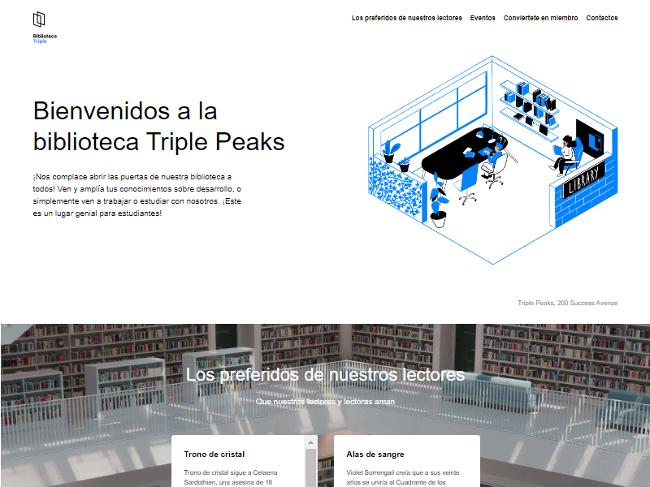

# Biblioteca Triple Peaks

La página web de la biblioteca Triple Peaks fue creada utilizando HTML y CSS, siguiendo un brief de diseño que buscaba ofrecer una experiencia intuitiva y atractiva a los usuarios.

## Previsualización del proyecto:

## Características del proyecto

- HTML5 semántico: Utiliza etiquetas semánticas para mejorar la accesibilidad.
- Flexbox.
- Secciones bien definidas: El contenido está organizado en secciones claras, incluyendo un encabezado, un cuerpo principal y un pie de página, lo que facilita la navegación.
- Imágenes y gráficos optimizados: Uso de imágenes optimizadas para mejorar la carga de la página y proporcionar un mejor rendimiento.

## Estructura del proyecto

- index.html: El archivo principal que contiene la estructura de la página.
- styles/: Carpeta que contiene los archivos CSS utilizados para dar estilo a la página.
- normalize.css: Para asegurar consistencia en los estilos entre diferentes navegadores.
- images/: Carpeta que contiene todos los recursos gráficos utilizados en la página, como logotipos, iconos y fotografías.
- vendor/: Carpeta para archivos de terceros, como el normalize.css.

## Tecnologías utilizadas

- HTML5: Estructura y contenido de la página.
- CSS3: Estilización de la página.
- Flexbox: Diseño responsivo y adaptable.

## © Luis González
